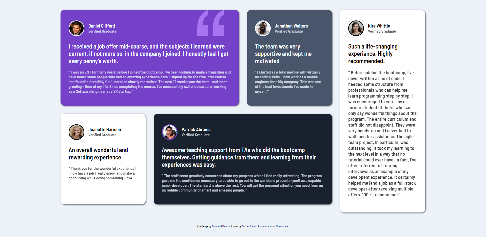
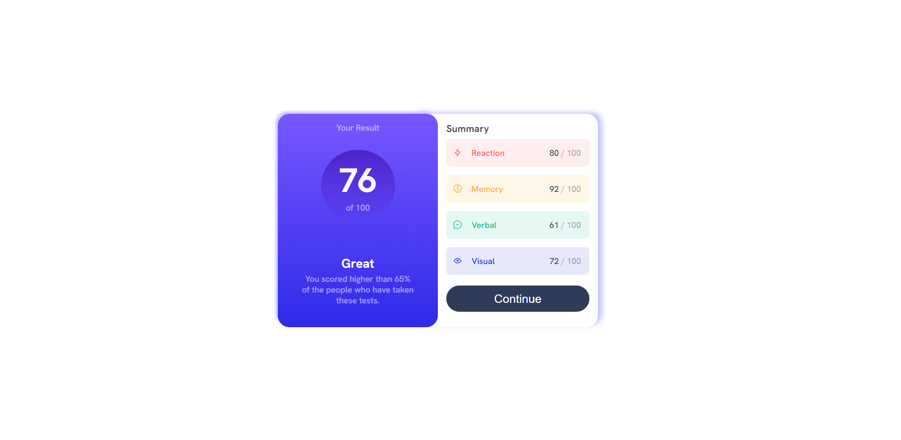
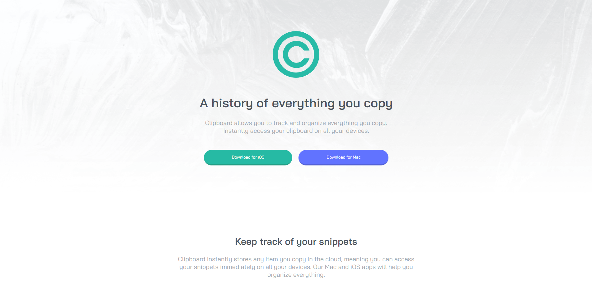
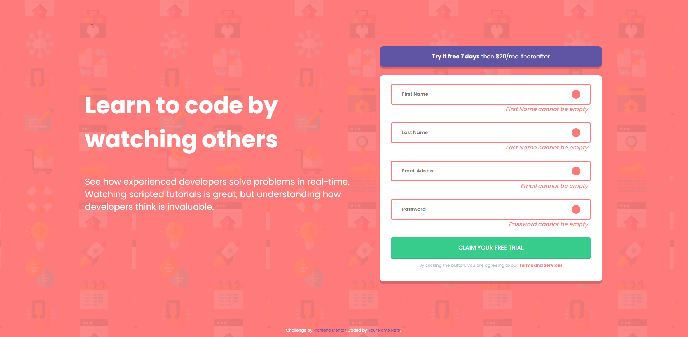
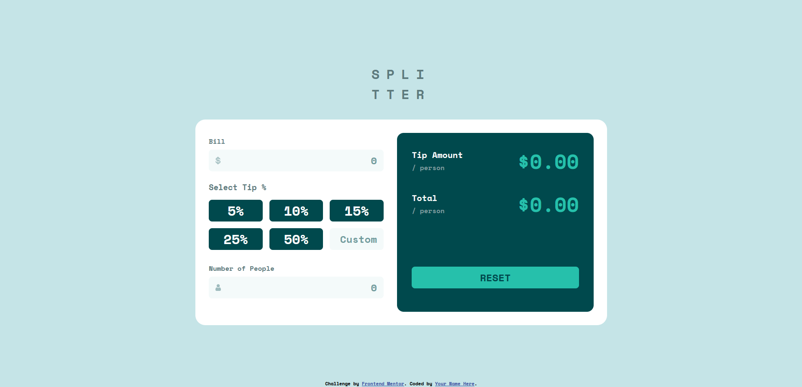
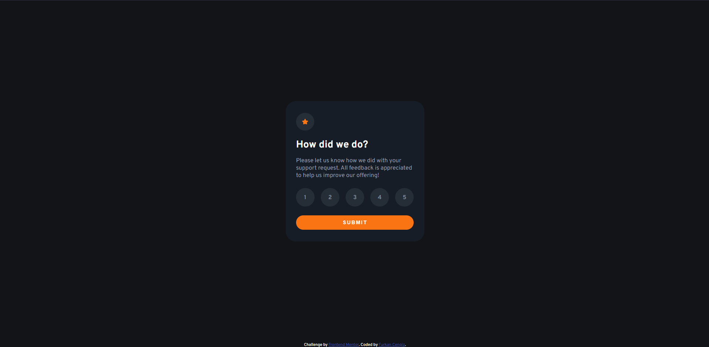

# FRONT-END PROJECTS

> Here you can find my projects to enhance my front-end skills with their live links.
> I will also add more information like what I learnt, what the difficulties I had and so on.
--------------
## Testimonial Grid Section

### Solved At 19.03.2023
### Difficulties:
- I implemented my newly acruired grid knowledge with a friend in recoded bootcamp. It was hard to remember all grid properties xD
### What I Tried New:
- Grid Layout
### Live Link and Preview
- __[Live Link](https://cheerful-moonbeam-d9cbdb.netlify.app/)__ \
**Preview of the challenge**

--------------
## Result Summary Challenge
### Solved at 23.03.2023
### Difficulties
- Drawing a decent circle for 76 of 100 was difficult.
### What I Tried New
- CSS Variables
### Live Link and Preview
- __[Live Link](https://4furki4.github.io/ResultSummeryComponentChallenge/)__ \
**Preview of the challenge** 

--------------
## Clipboard Landing Challenge
### Solved at 29.03.2023
### Difficulties:
-
### What I Tried New
- BEM convention for class names
### Live Link and Preview
- __[Live Link](https://clipboard-landing-page-challenge-4-furki4.vercel.app/)__ \
**Preview of the challenge**

--------------
## Product Preview Card Component
### Solved at 09.04.2023
### Difficulties:
- Font sizes and spacing between text had me have hard times :D I tried to make it as closer to the design as possible.
### What I Tried New:
- I used scss in a project for the first time. It made project progress way much easier bc of nesting with & symbol.

### Live Link and Preview
- __[Live Link](https://4furki4-product-preview-card.netlify.app/)__ \
**Preview of the challenge**

--------------
## Signup Form Challenge
### Solved at 14.04.2023
### Difficulties:
  - I think that it wasn't hard much, good practice though.
### What I Tried New:
  - I hadn't written client-side form input validation by myself before.
  - I learned that ``::placeholder`` exists xD
- __[Live Link](https://4furki4-signup-form-challange.netlify.app/)__ \
**Preview of the challenge**

--------------
## Tip Calculator Challenge
### Solved at 14.04.2023

### Difficulties
- I powered through not to repeat my code again and again, creating functions helped me a lot
- NaN and Infinite results drove me crazy just a bit hihihi
- Even though I don't like the grid system, I forced myself to use it for building percentage buttons and custom input so, I practiced grid template columns and rows  :)
### What I Tried New

- toFixed method to add 2 decimals at the end of results.
### Live Link and Preview
- __[Live Link](https://tip-calculator-4furki4.netlify.app)__ \
**Preview of the challenge**

## Interactive Rating Component

### Solved at 16.04.2023
### Difficulties:
- I didn't know how to restore the point in order to show it in thanks page. I tried using exports and imports which didn't do the trick. It took some time to use localStorage xD

### What I Tried New

- Tried using imports and export
- Used localStorage to store the rating point
- used window.location to navigate to the thanks page
### Live Link and Preview
- __[Live Link](https://zippy-yeot-4dbd04.netlify.app/)__ \
**Preview of the challenge**
