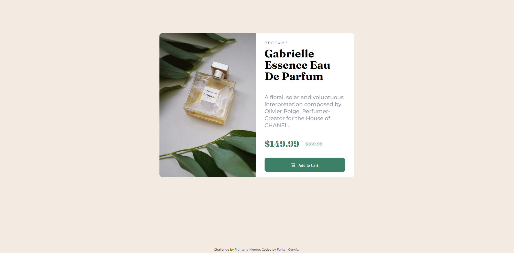

# FRONT-END PROJECTS

> Here you can find my projects to enhance my front-end skills with their live links.
> I will also add more information like what I learnt, what the difficulties I had and so on.
## Product Preview Card Component
### **Solved at 20.03.2023**
- Difficulties:
  - Font sizes and spacing between text had me have hard times :D I tried to make it as closer to the design as possible.
- What I Tried New:
  - I used scss in a project for the first time. It made project progress way much easier bc of nesting with & symbol.
- __[Live Link](https://4furki4-product-preview-card.netlify.app/)__
**Snapshot of the challenge**

## Signup Form Challenge
### **Solved at 14.04.2023**
- Difficulties:
  - I think that it wasn't hard much, good practice though.
- What I Tried New:
  - I hadn't written client-side validation by myself before.
  - I learned that ``::placeholder`` exists xD
- __[Live Link](https://4furki4-signup-form-challange.netlify.app/)__
**Snapshot of the challenge**
